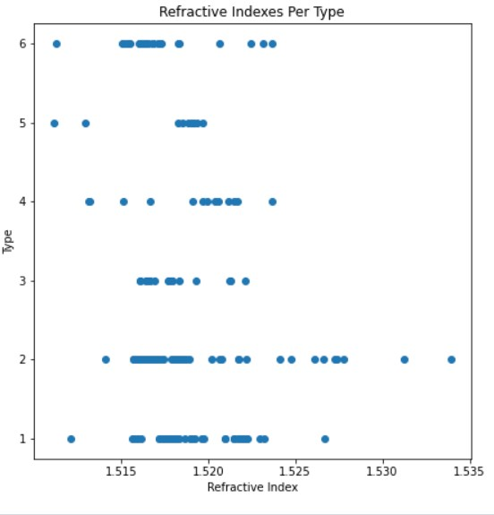

```{r setup, include=FALSE}
knitr::opts_chunk$set(echo = TRUE, eval = TRUE, fig.align = "center", warning = F, message = F,
tidy=TRUE, tidy.opts=list(width.cutoff=60), R.options=list(max.print=100))

class_diag <- function(score, truth, positive, cutoff=.5){

  pred <- factor(score>cutoff,levels=c("TRUE","FALSE"))
  truth <- factor(truth==positive, levels=c("TRUE","FALSE"))

  tab<-table(truth, pred)
  acc=sum(diag(tab))/sum(tab)
  sens=tab[1,1]/rowSums(tab)[1]
  spec=tab[2,2]/rowSums(tab)[2]
  ppv=tab[1,1]/colSums(tab)[1]

#CALCULATE F1
  f1=2*(sens*ppv)/(sens+ppv)
  
#CALCULATE EXACT AUC
  truth<-as.numeric(truth=="TRUE")
  ord<-order(score, decreasing=TRUE)
  score <- score[ord]; truth <- truth[ord]
  TPR=cumsum(truth)/max(1,sum(truth))
  FPR=cumsum(!truth)/max(1,sum(!truth))
  dup<-c(score[-1]>=score[-length(score)], FALSE)
  TPR<-c(0,TPR[!dup],1); FPR<-c(0,FPR[!dup],1)
  n <- length(TPR)
  auc<- sum( ((TPR[-1]+TPR[-n])/2) * (FPR[-1]-FPR[-n]) )
  round(data.frame(acc,sens,spec,ppv,f1,ba=(sens+spec)/2,auc, row.names = "Metrics"),4)
}
```

# Mining, Classification, Prediction

## Cristina Lafuente, cel726

### Introduction 

I chose the Glass Identification dataset from the MLBench repository for this project. I find this data particularly interesting because it breaks down the chemical composition of the glass into its base components and then, through data analysis, a model can be created which can be used to predict what a specific piece of glass came from. In this data set, there is a column listed as "RI" which is the Refractive index, commonly called 'n' and used in Snell's law to determine by how much light is bent through the glass. In addition to the Refractive Index, the dataset also has the amount of each of the elements Na: Sodium (unit measurement: weight percent in corresponding oxide, as are attributes 4-10), Mg: Magnesium, Al: Aluminum, Si: Silicon, K: Potassium, Ca: Calcium, Ba: Barium, Fe: Iron. Finally, there is a category called "Type" where type is listed as a number 1-7. Those correspond with: 
    1 building_windows_float_processed
--  2 building_windows_non_float_processed
--  3 vehicle_windows_float_processed
--  4 vehicle_windows_non_float_processed (none in this database)
--  5 containers
--  6 tableware
--  7 headlamps
In addition to these variables, I also added a binary variable to express simply whether this piece is window glass or not. As can be seen from the categories, window glass would correspond with anything of category 4 or lower while non-window glass would be category 5 or higher. 
  I found this dataset and it seemed particularly interesting because glass can be formed by nature (for example by lightning in the sand) as well as made by people and manipulated to form functional items like windows or simply to make art. It is interesting to think that it can be evaluated and sorted into different categories or types of data based on its chemical composition and refractive index.
  
  This is glass formed by lightning that has struck sand.
   
   This is a Daniela Forti Glass Sculpture. Both are glass but would have significantly different refractive indexes, and chemical compositions and should be able to be categorized differently by predictive models. 

```{R}
## some libraries to make things easier and make sure that data can be read and used 
library(tidyverse)
library(tidyr)
library(dplyr)
## the library that contains the data set
library(mlbench)
data(Glass) ## this is the data set to be used here
str(Glass)

glass<-(Glass) ## save the dataset as simply glass in order to use it more easily
dim(Glass) ## examine the dimensions 
head(glass) ## get a preview of the dataset
levels(glass$Type) ## see what levels are contained within the dataset
#head(glass)

## add a binary column that expresses only whether the glass is window glass or not
glass<-glass %>% 
  mutate(Window = case_when(as.numeric(Type) <= 4 ~ 1, as.numeric(Type) > 4 ~ 0))

##  change glass$Type to numeric since they were factor
glass$Type <- as.numeric(glass$Type)

#glass$Type

## take a look at the current dataset
glimpse(glass)
```

### Cluster Analysis

```{R}
library(cluster)

## set up the wss graph with kmeans.
## empty vector wss
wss<-vector() 
## function that goes from one to ten to test for possible k from 1 to 10
for(i in 1:10){
  ## remove the Type and Window from the dataframe since they are categorical variables then pass it to kmeans
temp<- glass %>% select(-(Type)) %>% select(-Window) %>% kmeans(i)
wss[i]<-temp$tot.withinss
}
## plot the whole thing
ggplot()+geom_point(aes(x=1:10,y=wss))+geom_path(aes(x=1:10,y=wss))+
  xlab("clusters")+scale_x_continuous(breaks=1:10)
```
Using the older method of the WSS graph for determining k, it is not completely clear how many clusters there should be. The "elbow" looks like it could be at 4 though it is also possible that it could be 7 since there is a continued sharp decline and then a rapid change in direction. Given that, I will also, use the sillhouette method.

```{r}
clust_dat <- glass %>% select(-(Type)) %>% select(-Window)
sil_width<-vector() #empty vector to hold mean sil width
for(i in 2:10){  
  kms <- kmeans(clust_dat,centers=i) #compute k-means solution
  sil <- silhouette(kms$cluster,dist(clust_dat)) #get sil widths
  sil_width[i]<-mean(sil[,3]) #take averages (higher is better)
}
ggplot()+geom_line(aes(x=1:10,y=sil_width))+scale_x_continuous(name="k",breaks=1:10)
```
Here it looks like 3 might be the best it can possibly be so I will attempt the clustering with k=3.

```{r}
set.seed(322)
kmeans1 <- clust_dat %>% kmeans(3)
kmeans1

#you can grab lots of stuff
kmeans1$size
kmeans1$centers
kmeans1$cluster
kmeans1$betweenss
kmeans1$tot.withinss
```

```{r}
pam1<-clust_dat%>%pam(k=3)
pam1
```
```{r}
pamclust<-clust_dat%>%mutate(cluster=as.factor(pam1$clustering))
pamclust%>%group_by(cluster)%>%summarize_if(is.numeric,mean,na.rm=T)
```

```{r}
glass%>%slice(pam1$id.med)
```


Here, K means and PAM clustering produce very nearly the same results, we can see that the medoids of the 2 clusters are type 3, type 4, and type 6 glass.  That also makes two of the clusters centered on windows and one non-windows. A few of the elements are very close together while others are farther apart. RI is different by only 0.00126 while Mg is different by 3.57. 

```{r}
pam1$silinfo$avg.width
plot(pam1,which=2)
```
Average silhouette width is 0.58 which is reasonable structure based on the standard cutoffs. This is also what I would have expected to get based on the previous graph which showed approximately 0.58 average silhouette width k=3. Based on that same graph, for other k values I could have expected to achieve silhouette width of only .35-0.41 which would have been considered weak, possibly artificial in origin. 

```{R fig.width=12, fig.height=6}
library(GGally)
final <- clust_dat %>% mutate(cluster=as.factor(pam1$clustering))
ggpairs(final, aes(color=cluster))
#ggpairs(final, columns =1:4, aes(color=cluster))
```
Interestingly, from this correlation matrix, we can see that there really isn't strong correlation between most of the elements and each other. However, there is actually strong correlation between Ca and RI. Additionally, in many cases, the clusters aren't particularly clear. Mg, identified above as being most different, has clusters significantly separated from one another. K has some decent separation as well. It is also clear that cluster 1 is much larger than the other clusters.

    
    
### Dimensionality Reduction with PCA

```{R}
# PCA code here
library(ggplot2)
library(ggsci)
glass_pca<-princomp(clust_dat, cor = T)
summary(glass_pca, loadings=T)

## to visualize the component information
eigval <-  glass_pca$sdev^2 #square to convert SDs to eigenvalues
varprop=round(eigval/sum(eigval), 2) #proportion of var explained by each PC

ggplot() + geom_bar(aes(y=varprop, x=1:9), stat="identity") + xlab("") + geom_path(aes(y=varprop, x=1:9)) + 
  geom_text(aes(x=1:9, y=varprop, label=round(varprop, 2)), vjust=1, col="white", size=5) + 
  scale_y_continuous(breaks=seq(0, .6, .2), labels = scales::percent) + 
  scale_x_continuous(breaks=1:10)

```

Through looking at the summary as well as the graph, it is clear that the top 2 components each provide about 25% of the information and then each provides less information. By the 5th component, nearly 90% of the data has been accounted for and once 6 components have been used, 95% of the data has been accounted for. This means that the remaining 3 components, collectively, only provide 5% of data. 

```{r}
## a more clear-cut way to show the cumulative variance
## the eigenvalues is amount of variance in direction of each PC
round(cumsum(eigval)/sum(eigval), 3) #cumulative proportion of variance

```

```{r}
glass_nums <- glass %>% select_if(is.numeric) %>% scale
eigen(cor(glass_nums))

```
```{r}
library(factoextra)
fviz_pca_biplot(glass_pca, col.ind = glass$Type, gradient.cols = c("red", "white", "navy")) + coord_fixed() 
```
The first 5 Components are all that should be kept in order to evaluate data most effectively, especially for those analytic methods like K-Nearest neighbors which do better with less features. By 5 components, more than 80% of the variance has been accounted which should give enough data to effectively create models that are able to interpret new data but are not distracted by noise which doesn't contribute as much to the overall information. 

```{r}
Name <-  rownames(glass)

#highest scores on PC1 
glass_pca$scores %>% as.data.frame %>% cbind(Name, .) %>% top_n(3, Comp.1) %>% 
  select(Name:Comp.5)

## These are specifically the first five principal components saved for possible further use
PC1 <- glass_pca$scores[,1]
PC2 <- glass_pca$scores[,2]
PC3 <- glass_pca$scores[,3]
PC4 <- glass_pca$scores[,4]
PC5 <- glass_pca$scores[,5]

```

These are the specific glass samples that scored highest on each of the principal components. 

###  Linear Classifier

```{R}
library(caret)
## separate into features and target portion where the binary column is the target
glass_X <- glass %>% select(-(Window)) %>% select(-(Type)) %>% as.data.frame
glass_y <- glass %>% select(Window)

```
Because Type is used here to create the binary column windows which is used to classify the data here, I will exclude type from analysis. 
```{r}
glass %>%
  ggplot( aes(glass$RI + glass$Na + glass$Mg + glass$Al + glass$Si + glass$K + glass$Ca + glass$Ba + glass$Fe,glass$Window))+geom_point()+geom_smooth(method="glm", se=F, method.args = list(family = "binomial"))+ylim(0,1)+geom_hline(yintercept=.5, lty=2)

fit_glm <- glm(glass$Window ~ glass$RI + glass$Na + glass$Mg + glass$Al + glass$Si + glass$K + glass$Ca + glass$Ba + glass$Fe,  family = "binomial")

p_hat_glm <- predict(fit_glm, type = "response")

p_hat_glm %>% round(3)
```

```{r}
class_diag(p_hat_glm, truth = glass$Window, positive = 1)
```
With Accuracy of 0.98 and AUC of 0.9979, this is model is actually very good at predicting whether the glass belongs to windows or not based on chemical composition and refractive index. The lowest score, of 0.9211, belongs to the specificity column which means that it does a slightly worse job of correctly predicting the true negatives. In this case, I have assigned the non window glass to be the negative. This may be in part because the data is slightly imbalanced. With cross validation, it is possible that there may be improvement in these numbers. 


```{R}
# cross-validation of linear classifier here
set.seed(1234)
k=10 #choose number of folds
data<-glass[sample(nrow(glass)),] %>% select(-Type)#randomly order rows
folds<-cut(seq(1:nrow(glass)),breaks=k,labels=F) #create folds
diags<-NULL
for(i in 1:k){
  ## Create training and test sets
  train<-data[folds!=i,] 
  test<-data[folds==i,]
  truth<-test$Window ## Truth labels for fold i
 
   ## Train model on training set (all but fold i)
  fit<-glm(Window ~ RI + Na + Mg + Al + Si + K + Ca + Ba + Fe, data=train, family="binomial")
  ## Test model on test set (fold i) 
  
  probs<-predict(fit, newdata = test, type="response")
  ## Get diagnostics for fold i
  
  diags<-rbind(diags,class_diag(probs,truth, positive = 1))
}

summarize_all(diags,mean) #average diagnostics across all k folds

## using caret to do the cross validation
#data ##testing
set.seed(430)

idx = createDataPartition(glass$Window, p = 0.75, list = FALSE)
train = glass[idx, ] %>% select(-(Type))
test = glass[-idx, ] %>% select(-Type)

train
glm_mod = train(Window ~ RI + Na + Mg + Al + Si + K + Ca + Ba + Fe, data = train, trControl = trainControl(method = "cv", number = 10), method = "glm",  family = "binomial")

summary(glm_mod)
glm_mod$results
```
Here, I can see that the Area Under the Curve is 0.957 which is not as high as before but with the cross validation method, I can see that there is likely to be more accuracy in this method because all of the cross validation. The Root Mean Squared Error is only 0.185 which is very low. The mean absolute error is also 0.0625 which is also very low. Considering the overall accuracy and area under the curve, it seems fair to say that this model is fairly accurate. 

### Non-Parametric Classifier

```{R}
library(caret)
fit<-knn3(Window ~ RI + Na + Mg + Al + Si + K + Ca + Ba + Fe, data=glass)
probs <- predict(fit, newdata = glass)[,2]
class_diag(probs, truth = glass$Window, positive = 1)
table(truth = glass$Window, predictions = probs > 0.5)

#data.frame(probs, glass$Window)
```

```{R}
set.seed(1234)
k = 10

data <- sample_frac(glass)
folds<-cut(1:nrow(glass), breaks=k, labels=F)

diags <- NULL


for (i in 1:k){
  train<-data[folds !=i,]
  test<-data[folds==i, ]
  truth <-test$Window
  fit<-knn3(Window ~ RI + Na + Mg + Al + Si + K + Ca + Ba + Fe, data=train)
  prob <- predict(fit, newdata = test)[,2]
  diags<-rbind(diags,class_diag(prob,truth, positive = 1))
}
summarize_all(diags,mean)

```
Since there is not a huge drop in the AUC from the single case to the cross validated case, there was likely some over-fitting but not a terrible amount. The AUC for the whole dataset was 0.9936 compared to 0.96 for the cross validated data. Either model is likely good but the cross validated model is more likely to continue to predict new data with this accuracy as it comes in. In both cases, specificity seems a bit low (especially compared to the other data) this is likely due, in part to an imbalance in the data set. Here true negatives are low.


```{r}
data.frame(probs, truth = glass$Window) %>%
  ggplot(aes(probs, color = truth)) + geom_density(aes(fill = as.factor(truth)))
```


### Regression/Numeric Prediction

```{R}
# regression model code here
library(rpart)
library(rpart.plot)
fit <- rpart(Type ~ RI + Na + Mg + Al + Si + K + Ca + Ba + Fe, data = glass)
## plot the regression partition fit
rpart.plot(fit)
## create the prediction based on the regression partition
pred<- predict(fit)
## get the mean squared error
mean((glass$Type - pred)^2)
```

```{R}
# cross-validation of regression model here
## set a seed so that the data pulls the same randoms each time
set.seed(1234)
## number of folds
k = 10
## set the data to the Glass data
data<-glass[sample(nrow(glass)),]
## fold info
folds<-cut(1:nrow(glass), breaks=k, labels=F)

MSE<-NULL
## function for fit, predict and MSE for each fold
for(i in 1:k){
  train<-data[folds !=i,]
  test<-data[folds==i, ]
  truth <-test$Type
  fit <- rpart(Type ~ RI + Na + Mg + Al + Si + K + Ca + Ba + Fe, data = train)
  pred<-predict(fit, newdata = test)
  MSE<-cbind(MSE,mean((truth-pred)^2))
}
## get the mean of the MSE 
mean(MSE)
```

For the regression model, I wanted to see if we could determine the specific type of the 7 types of glass, which window type specifically, whether it was an art piece or tableware, etc... The values of types are integer numbers from 1-7, in the case of the single model, the mean squared error is 0.64 which means that the distance from the model to the actual point is only 0.64. When cross validated, the mean squared error becomes 1.12 so there is obviously some over-fitting happening with the original data that is not happening in the cross validated version.

### Python 

```{R}
library(reticulate)
use_python("/usr/bin/python3")
#use_virtualenv("myenv")
#py_install("matplotlib")
plt <- import("matplotlib")
plt$use("Agg", force = TRUE)
#py_install("pandas")
#py_install("numpy")
np<- import("numpy")
pd<- import("pandas")
```

```{python}
## import the glass dataFrame from r to python using reticulate
glass = r.glass
type(glass) ## check what type of object glass is

## see how many of each type of glass object exist within the dataFrame
glass['Type'].value_counts()
 
## determine the mean of the columns
print("The mean of the columns is : \n", glass.mean())
## determine the median of the columns
print("The median of the columns is: \n", glass.median())
## determine the standard deviation
print("The standard deviation of the columns is \n:", glass.std())


## create a graph that shows the various refractive indexes of different types of objects made with glass
#plt.scatter(glass['RI'], glass['Type'])
#plt.xlabel("Refractive Index")
#plt.ylabel("Type")
#plt.title("Refractive Indexes Per Type")
#plt.show()

```
Here are some basic functions performed using reticulate to use python in r. First, I imported the dataFrame and checked its type. Using pandas, it was a pandas series. Then I counted how many occurrences of each type of glass there are in the dataFrame. Then, I checked the mean, median, and standard deviation of all the columns using numpy. Finally, using matplotlib, I plotted the refractive indexes against the types of glass. There is a lot of overlap but there was also some differentiation which is interesting to see. Unfortunately, when knitting this, there was some error with the way it was read and, I wasn't actually able to get this into the finished product. 


### Concluding Remarks

Overall, this dataset provided a some really clean data that was able to form some nice models. 


