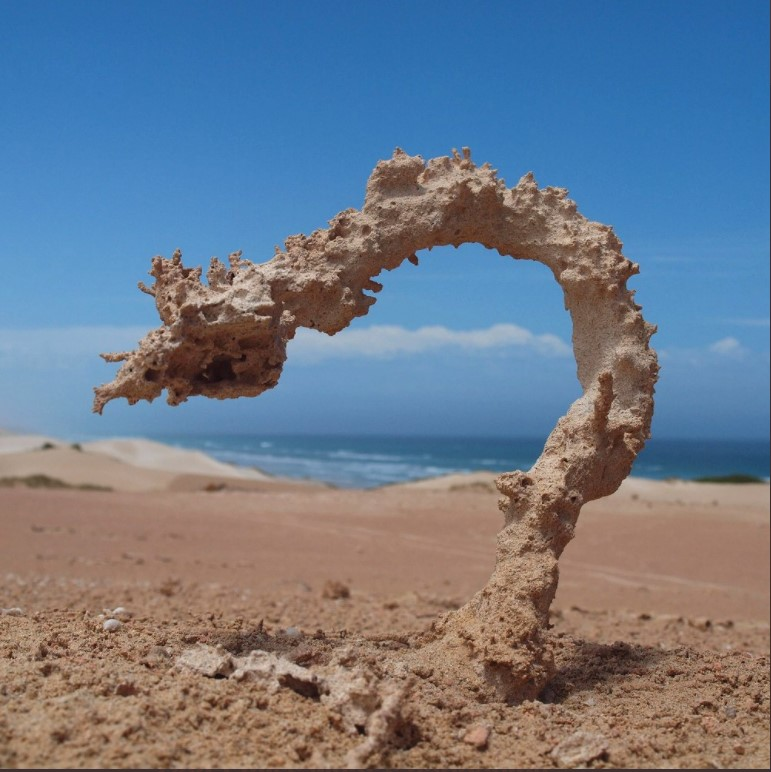
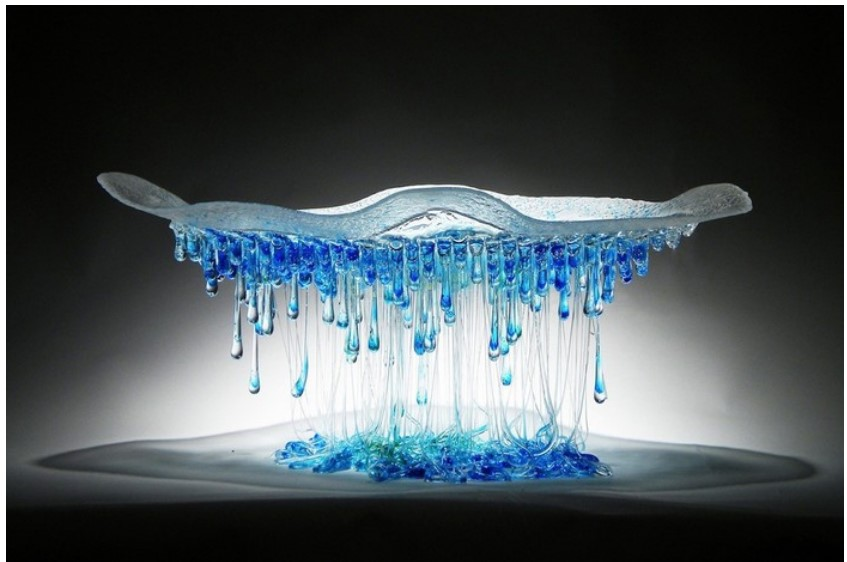

```{r setup, include=FALSE}
knitr::opts_chunk$set(echo = TRUE, eval = TRUE, fig.align = "center", warning = F, message = F,
tidy=TRUE, tidy.opts=list(width.cutoff=60), R.options=list(max.print=100))

class_diag <- function(score, truth, positive, cutoff=.5){

  pred <- factor(score>cutoff,levels=c("TRUE","FALSE"))
  truth <- factor(truth==positive, levels=c("TRUE","FALSE"))

  tab<-table(truth, pred)
  acc=sum(diag(tab))/sum(tab)
  sens=tab[1,1]/rowSums(tab)[1]
  spec=tab[2,2]/rowSums(tab)[2]
  ppv=tab[1,1]/colSums(tab)[1]

#CALCULATE F1
  f1=2*(sens*ppv)/(sens+ppv)
  
#CALCULATE EXACT AUC
  truth<-as.numeric(truth=="TRUE")
  ord<-order(score, decreasing=TRUE)
  score <- score[ord]; truth <- truth[ord]
  TPR=cumsum(truth)/max(1,sum(truth))
  FPR=cumsum(!truth)/max(1,sum(!truth))
  dup<-c(score[-1]>=score[-length(score)], FALSE)
  TPR<-c(0,TPR[!dup],1); FPR<-c(0,FPR[!dup],1)
  n <- length(TPR)
  auc<- sum( ((TPR[-1]+TPR[-n])/2) * (FPR[-1]-FPR[-n]) )
  round(data.frame(acc,sens,spec,ppv,f1,ba=(sens+spec)/2,auc, row.names = "Metrics"),4)
}
```

# Mining, Classification, Prediction

## Cristina Lafuente, cel726

### Introduction 

I chose the Glass Identification dataset from the MLBench repository for this project. I find this data particularly interesting because it breaks down the chemical composition of the glass into its base components and then, through data analysis, a model can be created which can be used to predict what a specific piece of glass came from. In this data set, there is a column listed as "RI" which is the Refractive index, commonly called 'n' and used in Snell's law to determine by how much light is bent through the glass. In addition to the Refractive Index, the dataset also has the amount of each of the elements Na: Sodium (unit measurement: weight percent in corresponding oxide, as are attributes 4-10), Mg: Magnesium, Al: Aluminum, Si: Silicon, K: Potassium, Ca: Calcium, Ba: Barium, Fe: Iron. Finally, there is a category called "Type" where type is listed as a number 1-7. Those correspond with: 
    1 building_windows_float_processed
--  2 building_windows_non_float_processed
--  3 vehicle_windows_float_processed
--  4 vehicle_windows_non_float_processed (none in this database)
--  5 containers
--  6 tableware
--  7 headlamps
In addition to these variables, I also added a binary variable to express simply whether this piece is window glass or not. As can be seen from the categories, window glass would correspond with anything of category 4 or lower while non-window glass would be category 5 or higher. 
  I found this dataset and it seemed particularly interesting because glass can be formed by nature (for example by lightning in the sand) as well as made by people and manipulated to form functional items like windows or simply to make art. It is interesting to think that it can be evaluated and sorted into different categories or types of data based on its chemical composition and refractive index.
  
  This is glass formed by lightning that has struck sand.
   
   This is a Daniela Forti Glass Sculpture. Both are glass but would have significantly different refractive indexes, and chemical compositions and should be able to be categorized differently by predictive models. 

```{R}
## some libraries to make things easier and make sure that data can be read and used 
library(tidyverse)
library(tidyr)
library(dplyr)
## the library that contains the data set
library(mlbench)
data(Glass) ## this is the data set to be used here
str(Glass)

glass<-(Glass) ## save the dataset as simply glass in order to use it more easily
dim(Glass) ## examine the dimensions 
head(glass) ## get a preview of the dataset
levels(glass$Type) ## see what levels are contained within the dataset
#head(glass)

## add a binary column that expresses only whether the glass is window glass or not
glass %>% 
  mutate(Window = case_when(as.numeric(Type) <= 4 ~ 1, as.numeric(Type) > 4 ~ 0))

##  change glass$Type to numeric since they were factor
glass$Type <- as.numeric(glass$Type)

#glass$Type

## take a look at the current dataset
glimpse(glass)
```

### Cluster Analysis

```{R}
library(cluster)
# clustering code here

```

Discussion of clustering here
    
    
### Dimensionality Reduction with PCA

```{R}
# PCA code here
```

Discussions of PCA here. 

###  Linear Classifier

```{R}
# linear classifier code here
```

```{R}
# cross-validation of linear classifier here
```

Discussion here

### Non-Parametric Classifier

```{R}
library(caret)
# non-parametric classifier code here
```

```{R}
# cross-validation of np classifier here
```

Discussion


### Regression/Numeric Prediction

```{R}
# regression model code here
```

```{R}
# cross-validation of regression model here
```

Discussion

### Python 

```{R}
library(reticulate)
```

```{python}
# python code here
```

Discussion

### Concluding Remarks

Include concluding remarks here, if any


